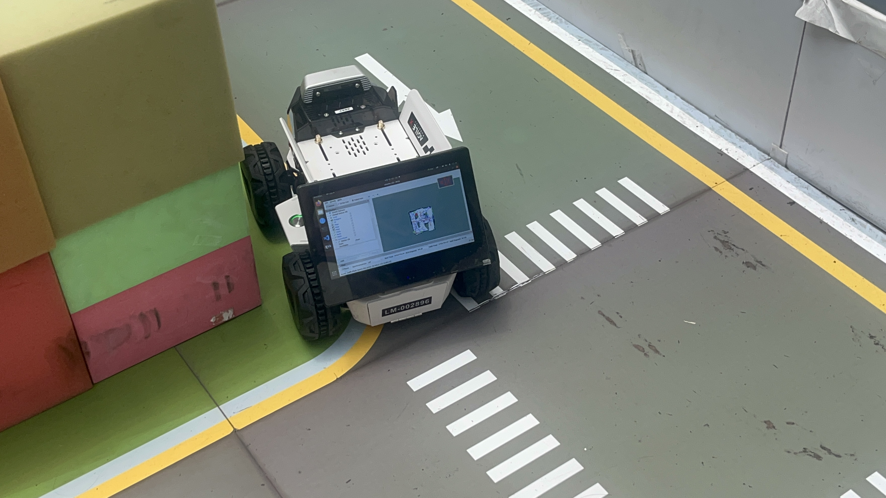
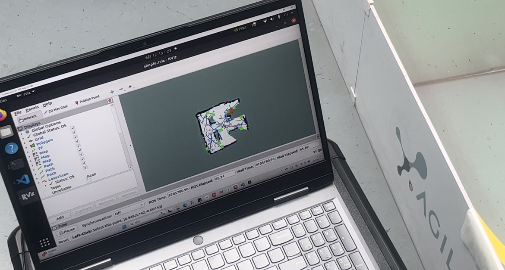

# 智能机器人 2025春 项目报告

组员：12110714 谢嘉楠、12210653 张伟祎

## 项目简述

项目基于松灵机器人LIMO Pro开发平台，将本学期课程中所学的自动驾驶相关算法集成并部署至 Limo 实车，完成完整任务流程，实现车辆在指定场地内的场景建图、车辆巡航、交通标志识别及响应等功能。

## 系统架构与工作流程

### 硬件平台架构

本系统基于LIMO Pro移动机器人平台构建，该平台集成了丰富的传感器组件。EAI T-mini Pro激光雷达提供360°环境扫描，测距范围0.02-12米，扫描频率6Hz，为环境感知和SLAM建图提供核心数据支撑。奥比中光DaBai深度相机具备640×400@30FPS的深度图分辨率和1920×1080@30FPS的彩色图分辨率，检测距离0.3-3米，为视觉识别任务提供高质量图像数据。

NVIDIA Jetson Orin Nano作为主控计算单元，配备6核Arm Cortex-A78AE处理器和1024个CUDA核心的GPU，8GB LPDDR5内存确保了深度学习模型的流畅运行。系统运行Ubuntu20.04操作系统和ROS Neotic框架，为多模块协同工作提供了稳定的软件环境。

### 系统架构

系统采用ROS（Robot Operating System）分布式框架实现各功能模块的高度解耦。通过发布/订阅通信模式，各模块之间通过标准化的话题接口进行数据交换，包括速度控制指令话题`/cmd_vel`、斑马线检测结果话题`/zebra_detected`、红绿灯状态话题`/traffic_light_mode`、激光雷达数据话题`/scan`和相机图像话题`/camera/color/image_raw`等。

### 整体流程

#### 建图模块与路径记录模块

建图模块（gmapping + RRT exploration）负责生成静态场景地图；
地图发布后，路径记录模块通过 TF 获取当前位置，记录巡航路径点；
模块通过 /map 与 /tf 话题连接，实现空间建图与轨迹采集的耦合。

#### 路径记录与路径跟踪（巡航）模块

路径记录模块将路径保存为 .txt；

#### 路径跟踪模块（Pure Pursuit）

读取文件生成 nav_msgs/Path 并进行跟踪；
两模块通过路径文件进行弱耦合，路径也通过 ROS 话题 /target_path 广播。

#### Pure Pursuit 跟踪与激光雷达（障碍物检测）模块

Pure Pursuit 模块订阅 /scan，实时调用 scanCallback() 获取前方障碍信息；
当检测到障碍物距离过近时，控制模块自动进入回退模式，避开障碍；
实现导航控制与环境感知模块的协作耦合。

#### Pure Pursuit 跟踪与交通标志识别模块

巡航模块订阅视觉模块发布的交通信号话题：

/zebra_detected（布尔型）→ 控制停车 1 秒 + 冷却；

/traffic_light_mode（整型）→ 红灯停、黄灯减速、绿灯通行；

视觉识别模块通过图像分析识别斑马线与红绿灯，向控制模块传递行为信号，实现感知-控制联动耦合。

#### 视觉识别模块与图像输入

摄像头节点 /camera/color/image_raw → 输入图像流；

视觉识别模块（detect_zebra.py, traffic_light.py）订阅图像流，进行图像处理与决策；

同时发布视觉调试图像 /traffic_detect_image，实现图像输入与识别模块的连接。

## 系统操作与部署

### 自动建图流程

系统的自动建图过程首先通过启动激光雷达节点`roslaunch limo_bringup limo_start.launch pub_odom_tf:=false`获取环境扫描数据。随后启动gmapping建图功能`roslaunch limo_bringup limo_gmapping.launch`，该模块基于粒子滤波SLAM算法处理激光雷达数据并构建占用栅格地图。move_base导航框架`roslaunch limo_bringup limo_move_base.launch`为RRT探索算法提供路径规划支持。最终通过RRT探索功能`roslaunch rrt_exploration simple.launch`实现场地的自主探索建图，整个过程无需人工干预。

```bash
#1.启动雷达
roslaunch limo_bringup limo_start.launch pub_odom_tf:=false
#2.启动建图功能
roslaunch limo_bringup limo_gmapping.launch
#3.启动move_base
roslaunch limo_bringup limo_move_base.launch
#4.启动RRT探索功能
roslaunch rrt_exploration simple.launch
```





### 车辆巡航部署

巡航系统的部署同样采用模块化启动方式。激光雷达节点的启动为定位和障碍物检测提供数据支撑。导航模式`roslaunch limo_bringup limo_navigation_diff.launch`加载预构建的地图并初始化AMCL定位算法。路径记录功能支持实时记录车辆轨迹，为后续的路径优化提供数据基础。车辆巡航的核心功能通过`roslaunch agilex_pure_pursuit new.launch`启动，该配置文件集成了Pure Pursuit路径跟踪、斑马线检测、交通标志识别等关键功能模块。

```bash
#1.启动雷达
roslaunch limo_bringup limo_start.launch pub_odom_tf:=false
#2.启动导航功能
roslaunch limo_bringup limo_navigation_diff.launch
#3.启动路径记录功能
roslaunch agilex_pure_pursuit record_path.launch
#4.启动车辆巡航功能
roslaunch agilex_pure_pursuit new.launch
```

### 参数调优策略

Pure Pursuit控制参数的精确调优对系统性能至关重要。最大线速度设置为0.3m/s确保了车辆在复杂环境中的安全运行，最大角速度1.25rad/s提供了足够的转向能力同时避免过度激进的动作。位置控制增益和角度控制增益的设定基于大量实验数据优化得出，在响应速度和稳定性之间取得了良好平衡。

视觉检测参数的调优充分考虑了实际应用环境的噪声干扰。斑马线检测的白色像素阈值250，最少白色像素数量3300个的设定有效避免了误检测现象。红绿灯颜色范围的HSV参数经过大量样本的统计分析确定，能够在不同光照条件下保持稳定的识别性能。

## 核心技术模块实现

### 自动建图

系统采用RRT（Rapidly-exploring Random Trees）算法实现场地的自主探索建图。该算法通过随机采样和快速扩展树结构生成探索路径，能够高效遍历未知环境区域。激光雷达扫描数据与RRT算法相结合，构建分辨率为0.05米/像素的高精度占用栅格地图，为后续的路径规划提供准确的空间环境模型。

### 路径记录

路径记录系统通过监听ROS的TF变换树实时获取车辆位置信息。record_path.cpp节点以20Hz的高频率采样车辆位置，设置5cm的距离阈值过滤冗余路径点，确保记录路径的精度和效率。路径数据以文本格式存储，包含完整的x、y、z坐标信息和四元数表示的姿态角度，为Pure Pursuit算法提供高质量的参考轨迹。通过高频采样和数字滤波技术，系统能够确保路径跟踪误差控制在±10cm以内。

### 路径跟踪

Pure Pursuit算法作为系统的核心路径跟踪模块，通过计算车辆当前位置到前瞻点的航向角来生成转向指令。算法设置0.4米的基础前瞻距离，并根据当前车速进行动态调整，确保在不同速度下都能保持稳定的路径跟踪性能。系统配置最大线速度为0.3m/s，最大角速度为1.25rad/s，位置控制容差为0.03m，角度控制容差为0.05rad，这些参数的精心调节确保了车辆运动的平滑性和精确性。

差速驱动控制系统通过独立控制左右轮速度实现车辆转向。PID控制器采用位置控制增益Kp=1.0和角度控制增益Kp=2.0的配置，在保证响应速度的同时避免超调现象。系统集成了前方0.2m×0.1m区域的障碍物检测功能，一旦检测到障碍物立即触发停车保护机制，确保系统运行安全。

该模块还接收智能视觉识别系统传递的信号，控制小车在识别到斑马线和红绿灯时做出正确的响应动作：

- 当检测到斑马线时，模块控制小车速度为0，并在1s后恢复。为防止小车在同一条斑马线上重复识别，模块设计了一个冷却机制，实现当小车检测到斑马线后，存在一段时间的冷却再对下一次检测到的斑马线进行控制。

- 当检测到红绿灯时，模块订阅节点接收红绿灯状态，红灯停车，黄灯减速，绿灯正常通过。

### 智能视觉识别系统

智能视觉识别系统包括斑马线检测模块和红绿灯识别模块。

斑马线检测采用基于图像处理的创新方法，通过分析图像下半部分的白色像素分布来判断斑马线的存在。算法设置白色像素阈值为250（0-255灰度值），最少白色像素数量为3300个，当图像下30%中的白色像素数量大于3300个时，检测识别到斑马线。为防止小车错误识别环境中的其他白色噪声（如白色围墙、其他白色物品），算法比较图像上70%的白色像素和下30%的白色像素，当上70%的白色像素少于下30%的白色像素的一半时，才会认为当前的检测是正确的。当检测条件满足时车辆自动停车1秒。为避免重复触发，系统实现了2秒冷却时间机制，这一设计充分考虑了实际应用场景的需求。

红绿灯识别系统采用 OpenCV 与 HSV颜色空间分割技术，通过精确的颜色阈值设定实现红、黄、绿三种状态的准确识别,使用 Hough 圆检测技术定位灯光区域，对每种灯光加入滤波、闭运算增强稳定性。系统针对红色设置了两个HSV范围：[0-8, 5-255, 150-255]和[175-180, 5-255, 150-255]，黄色范围为[20-30, 5-255, 150-255]，绿色范围为[35-90, 5-255, 150-255]。这种双阈值设计有效解决了红色在HSV色彩空间中的跨越问题。同样增加“冷却机制”避免对同一灯重复反应。系统实现了高可靠性的红绿灯识别。响应策略设计为：红灯时立即停车，黄灯时减速通过，绿灯时正常通行。

### 核心文件功能说明

| 文件名 | 功能描述 | 技术要点 |
|--------|----------|----------|
| `pure_pursuit.cpp` | 实现Pure Pursuit路径跟踪算法 | 前瞻点计算、转向角控制、PID调节 |
| `record_path.cpp` | 记录车辆运行轨迹 | TF变换监听、路径点采样、文件存储 |
| `detect_zebra.py` | 检测斑马线并控制停车 | 图像分割、白色像素统计、冷却机制 |
| `traffic_light.py` | 识别红绿灯状态 | HSV颜色空间、轮廓检测、状态判断、冷却机制 |

## 工作的创新性

### 基于视觉识别的动态决策控制机制

不同于传统依赖路径预存或硬编码逻辑的自动驾驶系统，本项目在车辆行为决策方面实现了真正的“端到端”感知-决策-控制闭环，建立了基于视觉信息实时驱动的动态行为控制机制。

斑马线与红绿灯的识别结果通过ROS话题系统同时发布了两类消息：

一类是用于控制决策的状态值（如 /traffic_light_mode）数据类型简单，提升通信效率，降低系统复杂性；

另一类是用于可视化调试的图像结果（如 /traffic_detect_image），直观反映系统感知内容；

该机制彻底摆脱路径点静态规划的依赖，实现了根据环境变化进行自适应控制的能力。提出了“信息即命令、感知即决策”的行为控制范式，显著增强了系统智能性与场景适应能力。

### 冷却机制防重复识别触发

为了适应实际场景中连续帧图像识别的波动性，项目在斑马线与红绿灯响应模块中均设计了时间冷却机制，具体包括：

控制响应触发后延迟一段时间再允许再次识别，避免由于车辆短时间未完全驶离而引起的误判与重复动作；

结合图像区域分布与逻辑条件进行双重过滤，有效提高了系统稳定性与识别逻辑可靠性。

该机制设计灵活，兼顾了响应及时性与识别准确性，显著增强了系统的实用性。

### 遇障碍物的自动回溯机制

在自动巡航过程中，系统新增了障碍物感知与回溯避障机制，实现了简单场景下的“脱困”功能，提升系统鲁棒性：

当前方障碍物持续阻挡且Pure Pursuit失效时，系统进入回溯模式；制逻辑自动反向以固定速度后退一定距离，并重新进入导航模式；回溯后系统会重新计算当前位置与路径点的最优连接段，继续完成任务；

该机制模拟了类人驾驶行为中的“后退再绕行”策略，在复杂环境（如内圈穿插路段）中有效避免死锁情况。
